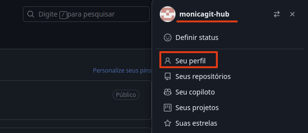
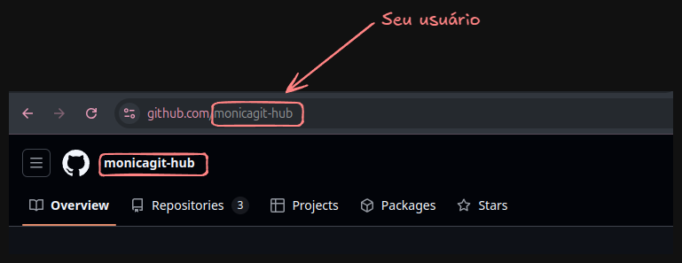
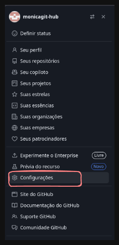
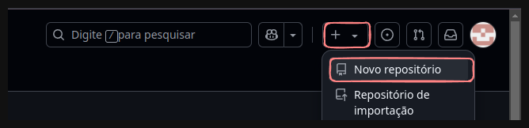
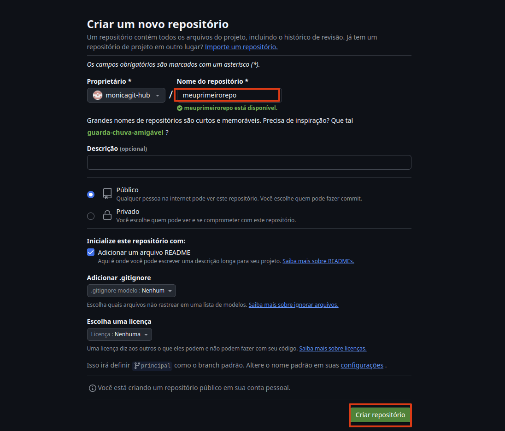
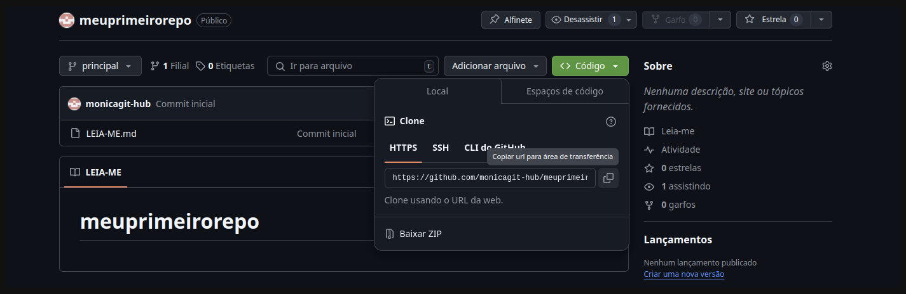

Para começar a usar o GitHub, Crie uma conta em https://github.com/:

0. Sistema utilizado: Linux-Ubuntu 24.04.1 LTS.

1. Após criar sua conta, volte ao terminal/prompt de comando para configurar seu usuário do GitHub:

        
        git config --global user.name "monicagit-hub"
        git config --global user.email "monicausuariogithub@gmail.com"

   1.1 Para identificar seu usuário e e-mail no seu GitHub:

    Clique no ícone no canto superior direito; logo no início, já aparecerá seu usuário.

     

   Ao clicar em "Meu Perfil", também será possível ver o nome de usuário na própria URL e na página inicial do seu GitHub.
        
     

   Para localizar o e-mail utilizado, vá em Configurações → E-mails

     
     

3. Verifique se seu usuário foi criado com sucesso:

        
        cat .gitconfig

    ou

        git config --list

4. No GitHub, crie seu primeiro repositório.

   Clique em Novo repositório:

     

   Adicione o nome do repositório e clique em Criar repositório.

    

5. Clonando o repositório na sua máquina:

    Copie a url do repositório:

     

6. Volte ao terminal/prompt de comando e digite o comando git clone seguido da URL copiada:

    Exemplo:

        git clone https://github.com/monicagit-hub/meuprimeirorepo.git

7. Acesse o repositório clonado:

        cd meuprimeirorepo

8. Inicialize o Git:

        git init